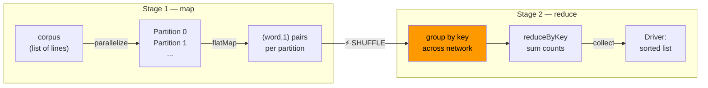
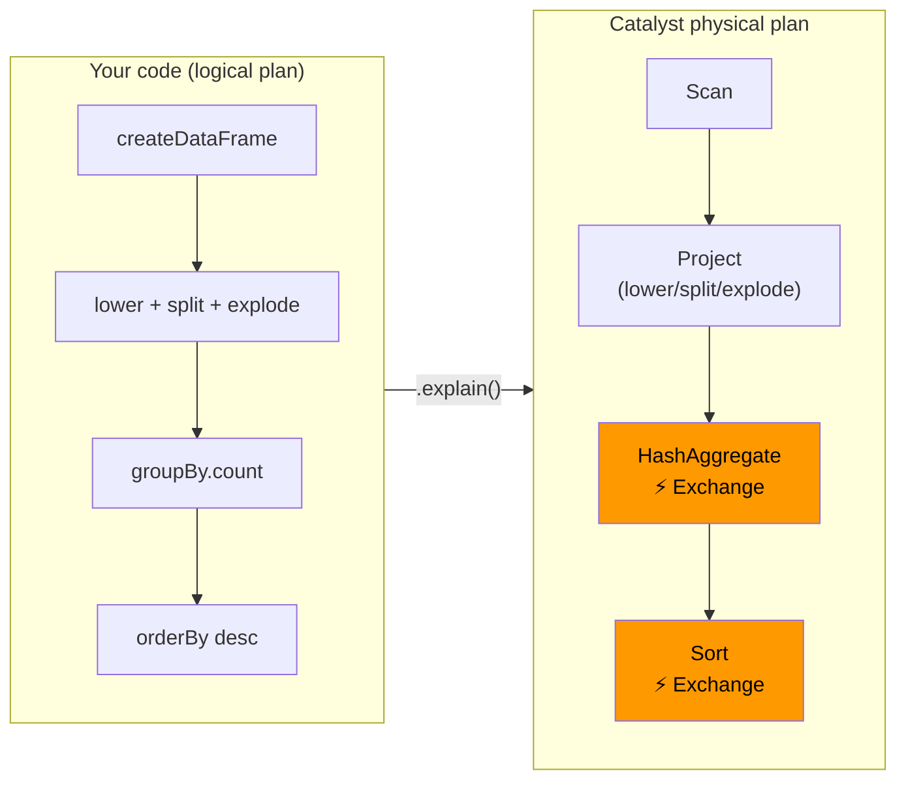
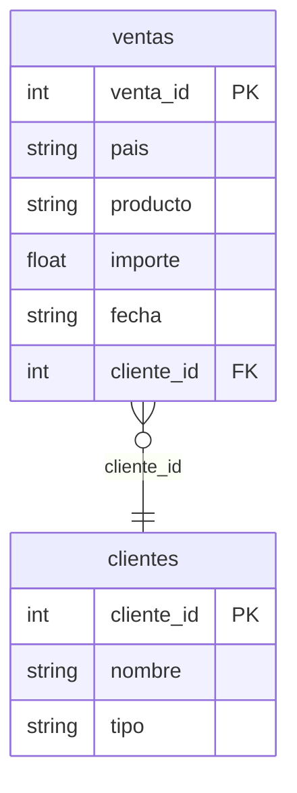
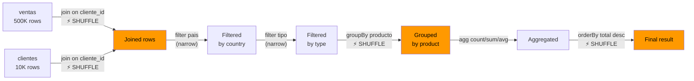
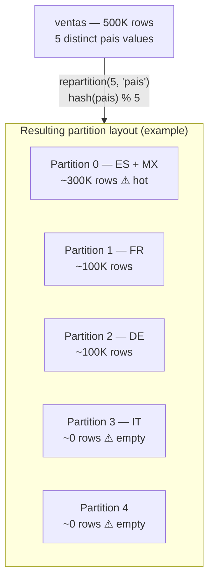
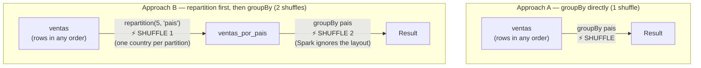

# Lab 10: PySpark — Instructions

In this lab you will use PySpark in local mode to understand the distributed
programming model at the core of big-data systems: lazy evaluation, the DAG
execution engine, shuffles, and partition-level parallelism — all without
needing a cluster.

[Tips & Reference Guide](lab10_guide.md)

---

## Pre-flight Checklist

!!! note "Platform setup"
    **macOS:** `brew install openjdk@17` then set `JAVA_HOME` in your shell profile.
    **Linux:** `sudo apt install openjdk-17-jdk`.
    **Windows:** follow the [Windows setup](lab10_guide.md#windows-setup--recommended-wsl2) section in the guide before continuing.

- **Java 17+** — verify with `java -version`. See the [guide](lab10_guide.md#java-requirement) if missing or if `JAVA_HOME` is not set.
- Install PySpark: `uv sync --group lab10`
- Verify PySpark: `uv run python -c "import pyspark; print(pyspark.__version__)"`
- Run the demo: `uv run python src/lab10.py` (Spark UI at <http://localhost:4040>)

!!! tip "Spark UI"
    Once the demo is running, open <http://localhost:4040> and keep it open
    throughout. Every action triggers stages, tasks, and shuffles you can
    watch there in real time.

---

## Exercise 1.1 — WordCount with RDDs (TODO 1)

!!! objective
    Implement `wordcount_rdd(sc, corpus, num_partitions)` using the low-level
    RDD API. This is the MapReduce pattern made explicit: map, then reduce.

**Why word count?** Word count is the "Hello World" of distributed computing —
simple enough to follow every step, yet it contains the two primitives that
define MapReduce: a *map* (emit one pair per word) and a *reduce* (sum by key).
The reduce requires grouping across all partitions, which forces a **shuffle** —
the most expensive operation in Spark. Starting here with the low-level RDD API
makes every step of that shuffle explicit and visible.



**Function:** `wordcount_rdd` in `src/lab10.py`

**Steps:**

1. Call `sc.parallelize(corpus, numSlices=num_partitions)` to distribute the
   list across partitions. No computation yet — this just registers the intent.
2. `flatMap(lambda line: [(w.lower(), 1) for w in line.split()])` — for each
   line, emit one `(word, 1)` tuple per word. `flatMap` flattens the list of
   lists into a flat stream of pairs.
3. `reduceByKey(lambda a, b: a + b)` — groups by the word key and sums the 1s.
   This is a **wide transformation**: it requires a shuffle.
4. `collect()` — this is the first **action** in the chain. Only now does Spark
   execute the entire plan. Watch it appear in the Spark UI.
5. Sort the Python list by count descending before returning.

**Verify:** `uv run pytest tests/test_lab10.py -k "TestWordcountRdd" -v`

**Reflect:**

1. At which line does Spark actually start computing? Why do all the
   transformations before it do nothing?
2. Open the Spark UI → Jobs tab. How many stages does this job have?

---

## Exercise 1.2 — WordCount with DataFrames (TODO 2)

!!! objective
    Re-implement the same word count using the DataFrame API. Compare the
    readability and the execution plan with the RDD version.

**Why re-implement it with DataFrames?** The DataFrame API is *declarative*: you
describe what you want, not how to compute it. Spark's Catalyst optimizer then
compiles your logical plan into an efficient physical plan — reordering operations,
fusing stages, and generating JVM bytecode. Implementing the same word count twice
lets you directly compare the two plans and see what Catalyst does that you didn't
ask for.



**Function:** `wordcount_dataframe` in `src/lab10.py`

**Steps:**

1. `spark.createDataFrame([(line,) for line in corpus], ["text"])` — wrap each
   string in a one-element tuple so Spark can infer a single column schema.
2. `.select(F.explode(F.split(F.lower(F.col("text")), " ")).alias("word"))` —
   chain `lower` → `split` → `explode` to produce one row per word.
3. `.groupBy("word").count()` — aggregate.
4. `.orderBy(F.desc("count"))` — sort descending.

After implementing, call `.explain()` on the result:

```python
df_result = wordcount_dataframe(spark, corpus)
df_result.show(10)
df_result.explain()           # default logical plan
df_result.explain(mode="extended")  # full physical plan
```

**Verify:** `uv run pytest tests/test_lab10.py -k "TestWordcountDataframe" -v`

Open the Spark UI → **SQL/DataFrame** tab → click the latest query link. You will see a DAG. 

---

## Exercise 2.1 — Synthetic Sales Data (TODOs 3 & 4)

!!! objective
    Generate two reproducible synthetic DataFrames — `ventas` (500 K rows) and
    `clientes` (10 K rows) — that will feed the analytics pipeline.

**Why synthetic data at this scale?** Toy datasets (a few dozen rows) run so fast
that shuffles, stage boundaries, and partition skew are invisible. 500 K rows is
large enough to produce measurable timings and visible skew in local mode, but
small enough to finish in seconds on a laptop.

The two DataFrames model a classic **star schema**: `ventas` is the *fact table*
(one row per transaction) and `clientes` is a *dimension table* (one row per
customer). This is the standard shape of a real data warehouse query — a large
fact table joined to a smaller lookup table on a foreign key.



**Functions:** `create_ventas` and `create_clientes` in `src/lab10.py`

**`create_ventas` schema** (6 columns):

| Column | Type | Notes |
|---|---|---|
| `venta_id` | int | Sequential (0-based) |
| `pais` | str | From `PAISES` (ES-weighted: 40 out of 100) |
| `producto` | str | From `PRODUCTOS` |
| `importe` | float | `round(random.uniform(10, 2000), 2)` |
| `fecha` | str | `"2025-MM-DD"` (day 1-28 to avoid invalid dates) |
| `cliente_id` | int | `random.randint(1, 10000)` |

**`create_clientes` schema** (3 columns):

| Column | Type | Notes |
|---|---|---|
| `cliente_id` | int | 1-based sequential |
| `nombre` | str | `"Cliente_<id>"` |
| `tipo` | str | `"premium"` or `"standard"` |

Use `random.seed(seed)` before generating data so results are reproducible.

After implementing, inspect what you built:

```python
ventas = create_ventas(spark, n_rows=500_000)
clientes = create_clientes(spark, n_clientes=10_000)
print(f"Ventas:   {ventas.count():,} rows")
print(f"Clientes: {clientes.count():,} rows")
ventas.printSchema()
ventas.show(5)
```

**Verify:** `uv run pytest tests/test_lab10.py -k "TestCreateVentas or TestCreateClientes" -v`

**Reflect:**

Open the Spark UI → **Jobs** tab → click the job triggered by `ventas.count()`.
How many stages does it have? There should be just one — a simple count with no shuffle.
Now click the job triggered by `clientes.count()`. Is it the same?

---

## Exercise 2.2 — Analytics Pipeline (TODO 5)

!!! objective
    Implement a multi-stage pipeline that joins the two DataFrames, filters,
    aggregates, and sorts. Identify every shuffle in the execution plan.

**Why this pipeline?** This is what a real analytics query looks like end-to-end.
Each *wide* transformation (join, groupBy, orderBy) forces a shuffle and creates
a new stage boundary. The exercise also demonstrates **predicate pushdown**: even
though you write the filters *after* the join, Catalyst automatically moves them
*before* it, so fewer rows travel across the network during the shuffle.



**Function:** `analytics_pipeline` in `src/lab10.py`

**Pipeline (in this order):**

1. `ventas.join(clientes, on="cliente_id", how="inner")` — wide transformation, shuffle
2. `.filter(F.col("pais") == pais)` — narrow transformation, no shuffle
3. `.filter(F.col("tipo") == tipo)` — narrow transformation, no shuffle
4. `.groupBy("producto")` — wide transformation, shuffle
5. `.agg(F.count("*").alias("num_ventas"), F.round(F.sum("importe"), 2).alias("total"), F.round(F.avg("importe"), 2).alias("media"))`
6. `.orderBy(F.desc("total"))` — wide transformation, shuffle

Time the full execution and inspect the plan:

```python
import time
t0 = time.perf_counter()
resultado = analytics_pipeline(ventas, clientes)
resultado.show()
print(f"Time: {time.perf_counter() - t0:.2f}s")
resultado.explain()
```

**Verify:** `uv run pytest tests/test_lab10.py -k "TestAnalyticsPipeline" -v`

**Reflect:**

Open the Spark UI → **SQL/DataFrame** tab → click the latest query.
Count the `Exchange` nodes in the DAG — each is one shuffle.
Then look at where the filters appear: are they before or after the join node?
(Catalyst's predicate pushdown moves them before the join automatically.)

---

## Exercise 3.1 — Partition Distribution (TODO 6)

!!! objective
    Implement `partition_distribution(df)` to count how many rows live in each
    partition. Are there any hotspots?

**Why inspect partition distribution?** Knowing how many rows land in each
partition is the first step to diagnosing performance problems. If one partition
holds 200 K rows while another holds 0, one task does all the work while the rest
sit idle — this is **partition skew**, the hot-spot problem. The skew here is
caused by hash collisions: `hash(pais) % 5` does not guarantee a 1-to-1 mapping
between the 5 country values and 5 partitions, so multiple countries can collide
into the same bucket while others stay empty.



**Function:** `partition_distribution` in `src/lab10.py`

**Steps:**

1. `df.rdd.mapPartitionsWithIndex(lambda idx, it: [(idx, sum(1 for _ in it))])` —
   the lambda receives `(partition_index, row_iterator)`. Consuming the iterator
   with `sum(1 for _ in it)` counts rows without materialising them.
2. `.collect()` to bring results to the driver.
3. Sort by `partition_id` ascending before returning.

Use it to inspect the partition layout before and after repartitioning:

```python
print(f"Default partitions: {ventas.rdd.getNumPartitions()}")

ventas_por_pais = ventas.repartition(5, "pais")
print(f"After repartition(5, 'pais'): {ventas_por_pais.rdd.getNumPartitions()}")

for part_id, count in partition_distribution(ventas_por_pais):
    bar = "█" * (count // 5000)
    print(f"  Partition {part_id}: {count:>7} rows  {bar}")
```

**Verify:** `uv run pytest tests/test_lab10.py -k "TestPartitionDistribution" -v`

**Reflect:**

Look at the bar chart printed in the terminal.
Are all 5 partitions roughly equal size, or are some large and some empty?
(You will likely see heavy imbalance — that is partition skew.)

---

## Exercise 3.2 — Repartition and Timing (TODOs 7 & 8)

!!! objective
    You will implement two tiny helper functions and use them to answer one
    question: is it faster to sort the data by `pais` first and *then* group,
    or just group directly? The implementations are one-liners — the point is
    the measurement.

**The experiment** compares two approaches to `groupBy("pais").sum("importe")`:

| Approach | Steps | Shuffles |
|---|---|---|
| **A — groupBy directly** | run `groupBy` on raw `ventas` | 1 shuffle |
| **B — repartition first, then groupBy** | call `repartition(5, "pais")` to sort data by country across partitions, *then* run `groupBy` hoping it can skip its shuffle | 2 shuffles |

The intuition behind approach B is: if each partition already contains only one
country, `groupBy("pais")` should have nothing to shuffle. This works in Hive
(it is called bucketing). In PySpark it does **not** work — Spark has no memory
of how a DataFrame was partitioned, so it always shuffles on `groupBy` regardless.
Approach B pays for an extra shuffle and ends up slower.



**Functions:** `repartition_by_column` and `measure_groupby_time` in `src/lab10.py`

**TODO 7 — `repartition_by_column`:** call `df.repartition(n_partitions, col)` and return the result.

**TODO 8 — `measure_groupby_time`:** record the time before and after running
`df.groupBy(group_col).sum(agg_col).collect()` using `time.perf_counter()`, then return the elapsed seconds.

After implementing, run the comparison:

```python
ventas_por_pais = repartition_by_column(ventas, "pais", 5)  # Approach B setup

t_a = measure_groupby_time(ventas, "pais", "importe")          # Approach A
t_b = measure_groupby_time(ventas_por_pais, "pais", "importe") # Approach B
print(f"Approach A — groupBy directly:          {t_a:.3f}s")
print(f"Approach B — repartition then groupBy:  {t_b:.3f}s")
```

**Verify:** `uv run pytest tests/test_lab10.py -k "TestRepartitionByColumn or TestMeasureGroupbyTime" -v`

**Reflect:**

Open the Spark UI → **SQL/DataFrame** tab. Find the two `groupBy` queries (Approach A and B). Can you spot the differences? 

---

## What to Submit

1. `src/lab10.py` with all 8 TODOs implemented and your name and `STUDENT REFLECTION` filled in at the top.

--- 

I hope you enjoyed the lab sessions! You can help me by giving the [bigdata](https://github.com/alvarodiez20/bigdata) repository a GitHub star :star: 
